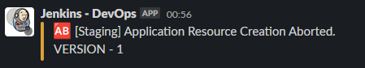

# Running Jenkins Pipeline for the Terraform Network

## Jenkins Configuration

2 Node Architecture (Master + Worker)

In the worker node following software are installed.

- Terraform
- AWS CLI
- Git
- Infracost

Blue ocean Jenkins plugin will be installed as it provides a cleaner interface.

## Running Pipeline

### 1. Set The Parameter -> Infrastructure Version

### 2. Validate The Parameter

### 3. Download The Repository

### 4. Initialize / Upgrade Terraform

### 5. Validate Terraform Configuration

### 6. Generate Terraform Plan

### 6.1 Upload The Generate Plan to S3 (Artifact)

### 7. Identify Cost Changes Using InfraCost

### 8. Request User Approval

### 9. Resource Creation

Note -> Please note that the pipeline was manually aborted at this stage.

### 10. Slack Notification (Aborted Message)

